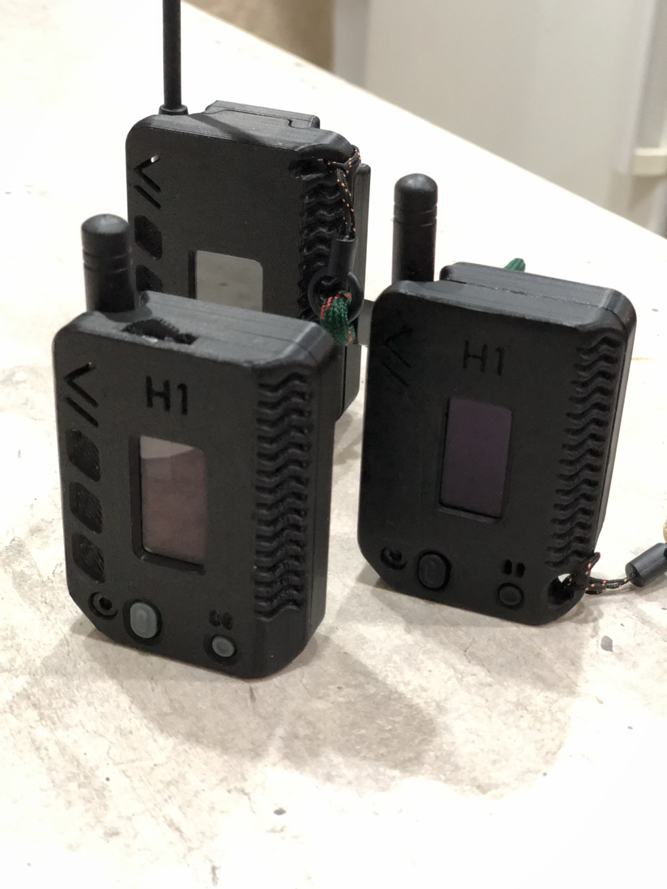
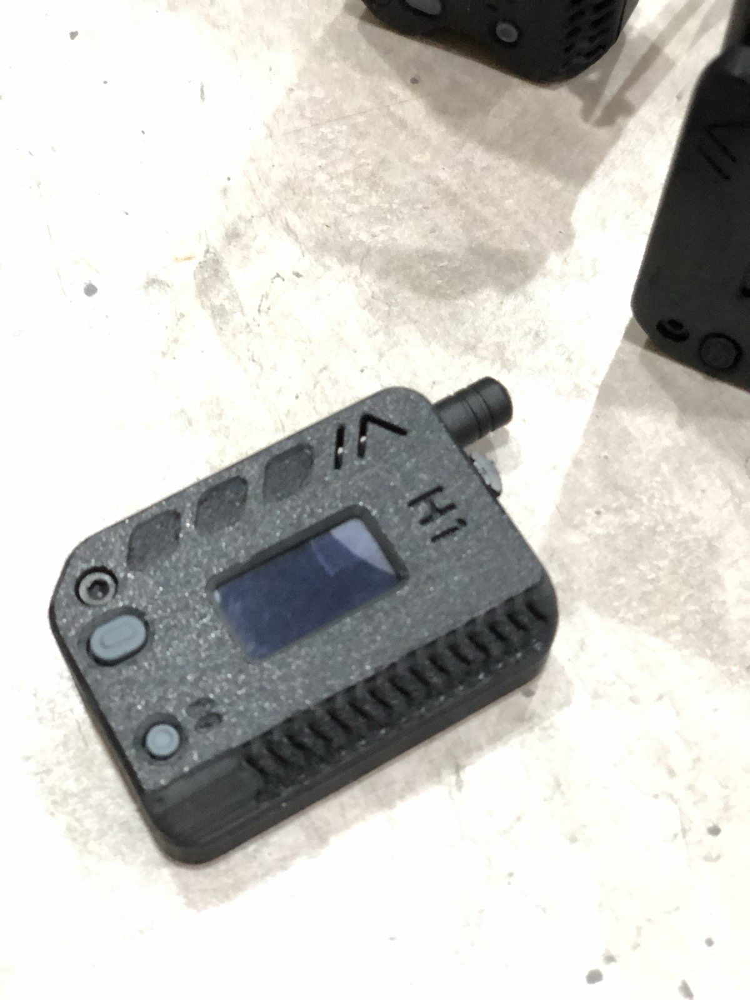
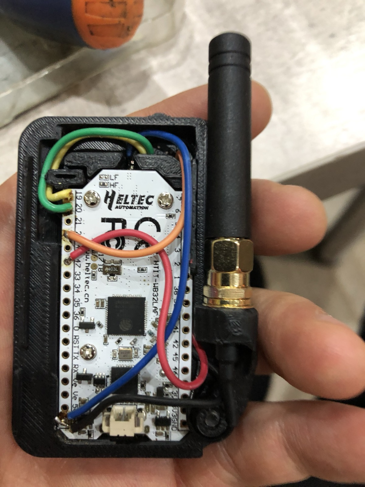
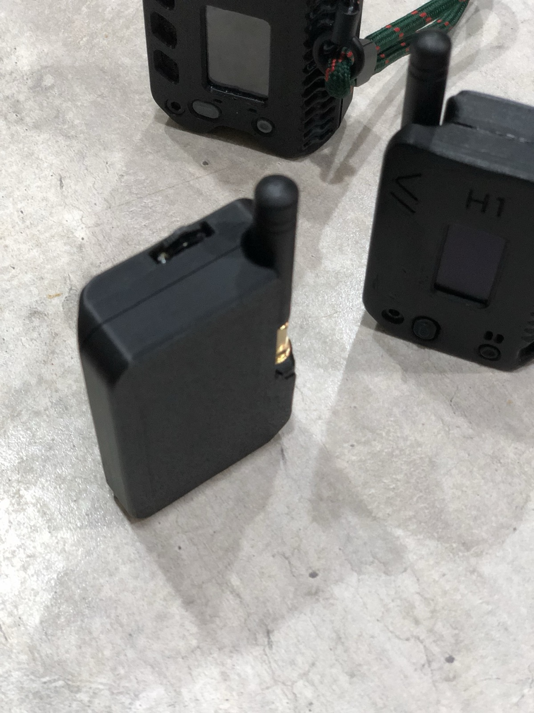

# Meshtastic Heltec V3 · toggle + buzzer build



A pocket Meshtastic node built on the **Heltec WiFi LoRa 32 V3** in the [Muzi H1 remix case by LWC](https://www.printables.com/model/853651-meshtastic-muzi-h1-remix-1100mah-version-no-brandi), with a **3-way navigation toggle**, a **buzzer** and a **1100 mAh battery**. This repo has the firmware that makes the toggle work on current Meshtastic, a browser flasher, and the wiring and build notes.

**Flash it here:** https://djaysan.github.io/meshtastic-heltec-v3-updown/

## Why a custom firmware

Meshtastic lets you wire up/down/select buttons to any GPIO and configure them in the canned message module (`updown1_enabled` plus three `inputbroker_pin_*` values). Since firmware **2.7.16** that driver is only compiled in for boards whose variant defines `INPUTDRIVER_ENCODER_TYPE 2`. The Heltec V3 doesn't, so on stock 2.7.16 through 2.7.26 and current master the setting is accepted and silently ignored. Upstream issue [meshtastic/firmware#9707](https://github.com/meshtastic/firmware/issues/9707) documents it and was closed as stale.

This build is stock **v2.7.26** plus two small patches, see [heltec-v3-updown.patch](heltec-v3-updown.patch):

1. `INPUTDRIVER_ENCODER_TYPE=2` added to the Heltec V3 build flags, so the up/down/select driver is compiled in and reads its pins from your config.
2. The side (PRG) button remapped to a preset shortcut, since the toggle already covers navigation. Guarded by `HELTEC_V3`, nothing else changes.

## What the buttons do

| Input | Action |
|---|---|
| Toggle down / up | Next / previous screen. In a menu or list: next / previous item. |
| Toggle push | Open the menu for the current screen, or select the highlighted item. |
| Toggle hold up / down | Scroll message text on the messages screen. |
| Side button, short press | Open the preset message list, broadcast on the primary channel. Press again to close. |
| Side button, hold 0.5 s | Back. Closes any menu or list. |
| Side button, hold 4 s | Shutdown. |

Sending a preset: side button, scroll with the toggle, push. Three actions from any screen.

## Hardware



| Part | Notes |
|---|---|
| Heltec WiFi LoRa 32 V3 | V3.0 / V3.1. The V3.2 with the helical Bluetooth antenna does not fit this case. |
| Case | [Muzi H1 remix, 1100 mAh version by LWC](https://www.printables.com/model/853651-meshtastic-muzi-h1-remix-1100mah-version-no-brandi). Print `flipopen + Buzzer + navigation switch TOP`, `flipopen BeltClip BASE` (or the plain base) and `navigation switch protector`. The model's changelog lists the exact switch and buzzer it was designed around. |
| Navigation switch | SMD 3-way navigation wheel switch (up / down / push), 12 × 9 mm body, 14.2 mm across the wheel, 2.5 mm tall. Sold on AliExpress as a 3-direction wheel or roller switch. Cut off the two side arms of the wheel so it fits the case, as marked in the model's gallery. |
| Buzzer | MLT-8530 SMD passive buzzer, 8.5 × 8.5 × 3 mm, 3 V. Passive is required, the firmware drives it with PWM from GPIO 47. |
| Battery | 3.7 V 1100 mAh LiPo with protection board, JST 1.25 plug for the Heltec. |
| Antenna | SMA pigtail (u.FL to SMA) and a stubby 868 MHz SMA antenna, up to 10 mm at the base. |
| Hardware | M3x12 mm screw for the case, M3x0.5 tap for the post. |
| Wire | Thin silicone wire, 28 to 30 AWG. |

## Wiring



All inputs use the ESP32's internal pull-ups and trigger on the falling edge, so every switch contact goes to **GND**. No resistors needed.

| Signal | Heltec V3 pin | Wire in the photo |
|---|---|---|
| Toggle up | GPIO 26 | blue |
| Toggle down | GPIO 19 | green |
| Toggle push | GPIO 20 | yellow |
| Toggle common | GND | |
| Buzzer + | GPIO 47 | red |
| Buzzer − | GND | black |

GPIO 19 and 20 are free on the Heltec V3 because USB goes through the CP2102 bridge, not the native USB pins. GPIO 47 sits on the left header next to 33. Wire colours are what this build used, use whatever you have.

## Build

1. Print the top, base and switch protector. Matte filament gives more grip. Tap the M3x0.5 post on the base, stop before the wall.
2. Solder the five signal wires and two grounds to the header pads on the Heltec, not through the holes, so the board still sits flat.
3. Fit the toggle into the top from the inside and add the protector. Seat the buzzer in its pocket in the top.
4. Screw the SMA pigtail into the top, connect the u.FL end to the board.
5. Plug in the battery, lay the board in, dress the wires away from the antenna, snap the halves together, secure with the M3x12.



## Flash

Browser flasher, Chrome or Edge on desktop, node on USB: **https://djaysan.github.io/meshtastic-heltec-v3-updown/**

Click **Flash firmware**, pick the port, choose Install. In the dialog:

- **Leave "Erase device" unticked** to keep your config. The image writes bootloader, partition table and app from address 0 and never touches the settings area. Works from any earlier version, 2.6.x included.
- **Tick "Erase device"** only for a blank or bricked board. Everything is wiped.

Command line equivalent, keeps config:

```
esptool --port /dev/cu.usbserial-0001 --baud 921600 write-flash 0x0 firmware-heltec-v3-2.7.26-updown-factory.bin
```

**Never accept an over-the-air update from the phone app on a patched node.** It reinstalls stock firmware and the toggle goes dead again. Update from this page instead.

## Configure

### Configure from the browser

The flasher page has a **Configure the node** section that pushes all of the settings below over the same USB cable, using Web Serial and the official [Meshtastic JS](https://github.com/meshtastic/js) packages. No phone app, no Python, no OTA.

**https://djaysan.github.io/meshtastic-heltec-v3-updown/**

Fill the form, press **Connect and apply**, pick the port. The page shows a step by step log and ends with *Rebooting, unplug and plug the next node*, so a batch of boards goes through quickly. Everything you type is kept in the browser, so the next node gets the same settings without retyping.

| Field | What it does |
|---|---|
| Region, modem preset | `lora.region` and `lora.modem_preset`, with `use_preset` turned on. |
| Long name, short name | The node owner. Leave empty to keep the name already on the node. |
| Channel | Keep the channels on the node, or paste a `https://meshtastic.org/e/#...` share link. The first channel in the link becomes the primary, the rest secondary, and the LoRa settings in the link are merged in. |
| Preset messages | One per line, joined with `\|`. Live counter against the 200 character firmware limit. |
| Ringtone | Fourteen ready-made RTTTL tunes, or paste your own. **Preview** plays it in the browser first, so you can pick one without writing to the node. 230 character limit. |
| Toggle | `canned_message.updown1_enabled` plus the three `inputbroker_pin_*` values, and `device.button_gpio` back to 0. |
| Buzzer | `device.buzzer_gpio` plus the whole external notification module on PWM. |
| Send bell | `canned_message.send_bell`, so the receiving node beeps. |
| Timezone | `device.tzdef`, a POSIX TZ string. |

Every field is optional. Anything left empty is left exactly as it is on the node.

It works on any node running Meshtastic 2.6 or newer, flashed from this page or not. Chrome or Edge on desktop, since Web Serial is not in Firefox or Safari.

Two things worth knowing about how it writes:

- `set_config` and `set_module_config` replace a **whole** section. The page always reads the section off the node first, changes only the fields you picked, and sends the complete section back, so nothing else in it gets zeroed.
- All the writes go inside one `begin_edit_settings` / `commit_edit_settings` transaction, so the node saves and reboots once at the end.

The same logic runs from the command line, against a node plugged into this machine:

```
npm install
node scripts/apply-node.mjs --port /dev/cu.usbserial-0001 --options scripts/options-example.json
```

`scripts/options-example.json` holds this build's defaults: EU_868, LONG_FAST, toggle on 26 / 19 / 20, buzzer on 47, send bell, CET with daylight saving and sixteen preset messages. Copy it, edit it, point `--options` at your copy. `--dry-run` prints the steps without touching a port, and `--help` lists the options file fields.

Rebuild the browser bundle after changing anything in `src/`:

```
npm run build   # esbuild src/configure-page.js -> dist/configure.js
npm test        # node --test, no hardware needed
```

`dist/configure.js` is committed, because GitHub Pages serves static files and never runs a build.

### Configure from the phone app or the Python CLI

Set these once per node, from the phone app (Module config → Canned messages, Module config → External notification, Device) or with the [Meshtastic CLI](https://meshtastic.org/docs/software/python/cli/):

```
meshtastic --set lora.region EU_868
meshtastic --set canned_message.enabled true
meshtastic --set canned_message.updown1_enabled true
meshtastic --set canned_message.inputbroker_pin_a 26
meshtastic --set canned_message.inputbroker_pin_b 19
meshtastic --set canned_message.inputbroker_pin_press 20
meshtastic --set device.buzzer_gpio 47
meshtastic --set external_notification.enabled true
meshtastic --set external_notification.use_pwm true
meshtastic --set external_notification.output_buzzer 47
meshtastic --set external_notification.alert_message_buzzer true
meshtastic --set external_notification.alert_bell_buzzer true
meshtastic --set-canned-message "Roger|Yes|No|Test|I'm OK|Need help|Where are you?|Send your location"
```

Notes:

- `device.buzzer_gpio` must be 47. Without it the 2.7 sound path stays silent even with the notification module fully set up.
- `device.button_gpio` stays at 0. The side button is GPIO 0.
- The `inputbroker_event_*` values are ignored since 2.7.15. Events are fixed in firmware.
- A working node shows `Up/down/press GPIO initialized (26, 19, 20)` in its serial log on boot.
- The joined preset message string is capped at 200 characters and the ringtone at 230, both from the nanopb `max_size` options in the protobufs.

## Rebuild from source

```
git clone --depth 1 --branch v2.7.26.54e0d8d --recurse-submodules --shallow-submodules https://github.com/meshtastic/firmware.git
cd firmware
git apply ../heltec-v3-updown.patch
pio run -e heltec-v3
# .pio/build/heltec-v3/firmware-heltec-v3-2.7.26.54e0d8d.factory.bin  -> flash at 0x0
```

The patch touches `variants/esp32s3/heltec_v3/platformio.ini` (one build flag) and `src/input/InputBroker.cpp` (side button mapping). It should apply to nearby releases with little or no change.

## Credits and license

- Case: [Muzi H1 remix by LWC](https://www.printables.com/model/853651-meshtastic-muzi-h1-remix-1100mah-version-no-brandi), remixed from the Muzi Works H1, licensed CC BY-NC-SA 4.0. Not included here, download it from Printables. Photos in this repo are of my own builds.
- Firmware: derived from [meshtastic/firmware](https://github.com/meshtastic/firmware), GPL-3.0. The patch and binaries here are under the same license.
